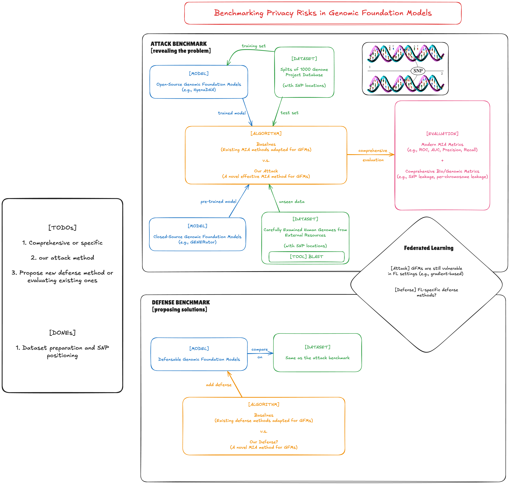
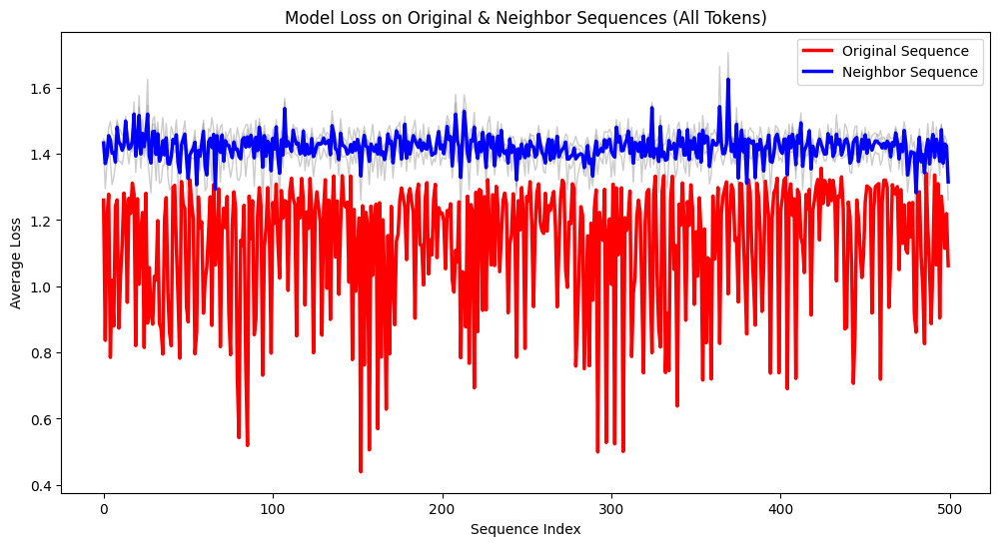
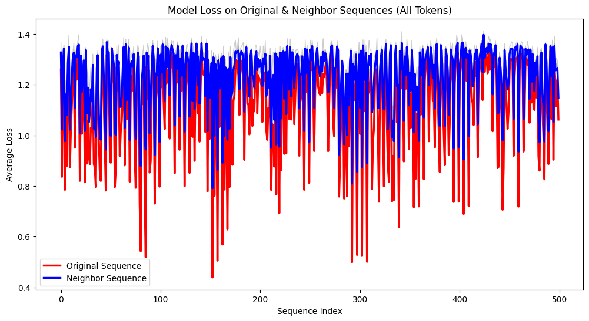

# Membership Inference Attacks on Genomic Foundation Models

Benchmarking membership inference attacks on genomic foundation models. The following shows the organization of our benchmark.

## Experiments

We conduct experiments to evaluate the privacy leakage of genomic foundation models (GFMs) under grey-box settings.

### Setup

Target Model: HyenaDNA

GPU: NVIDIA A100-SXM4-40GB  

### Numerical Results

#### Neighborhood Comparison

Given a sequence of confirmed training-set membership, we construct its neighbors by changing the nucleotides at SNP positions (we obtain these locations from dbSNP database and align them with the reference genome), of a certain replacement probability (we used 60%, 80%, and 100% in our experiments). We then compute the average loss of the original sequence and its neighbors under the target GFM, the results are shown below:

Hyperconfigs:
- number of original sequences: 500 (sequences at fixed indices in chromosome 1, 2, 3, 4, X)
- length of each sequence: 2000 base pairs
- grey curves: loss on individual neighbor; blue curve: average loss on neighbors; red curve: loss on original sequence.
- average ratio of SNP positions in each sequence: 41.33%

The following figure uses 3 as the number of neighbor sequences per original sequence, with 60%, 80%, and 100% SNP replacements

The following figure uses 3 as the number of neighbor sequences per original sequence, with 10%, 20%, and 30% SNP replacements

If we consider only model's loss on SNP positions, the difference between original sequences and their neighbors becomes very obscure, while if we consider loss on all tokens, the difference is much more obvious. By setting a proper threshold on the loss difference on all tokens, we can achieve a good membership inference performance. The following figure shows the precision score under different thresholds (for the 10%-20%-30% SNP replacements setting):

| Threshold | Precision |
|------------|------------|
| 0.00 | 0.000 |
| 0.01 | 0.000 |
| 0.02 | 0.006 |
| 0.03 | 0.058 |
| 0.04 | 0.128 |
| 0.05 | 0.244 |
| 0.06 | 0.358 |
| 0.07 | 0.436 |
| 0.08 | 0.512 |
| 0.09 | 0.568 |
| 0.10 | 0.606 |
| 0.11 | 0.652 |
| 0.12 | 0.688 |
| 0.13 | 0.710 |
| 0.14 | 0.742 |
| 0.15 | 0.786 |
| 0.16 | 0.816 |
| 0.17 | 0.840 |
| 0.18 | 0.854 |
| 0.19 | 0.870 |